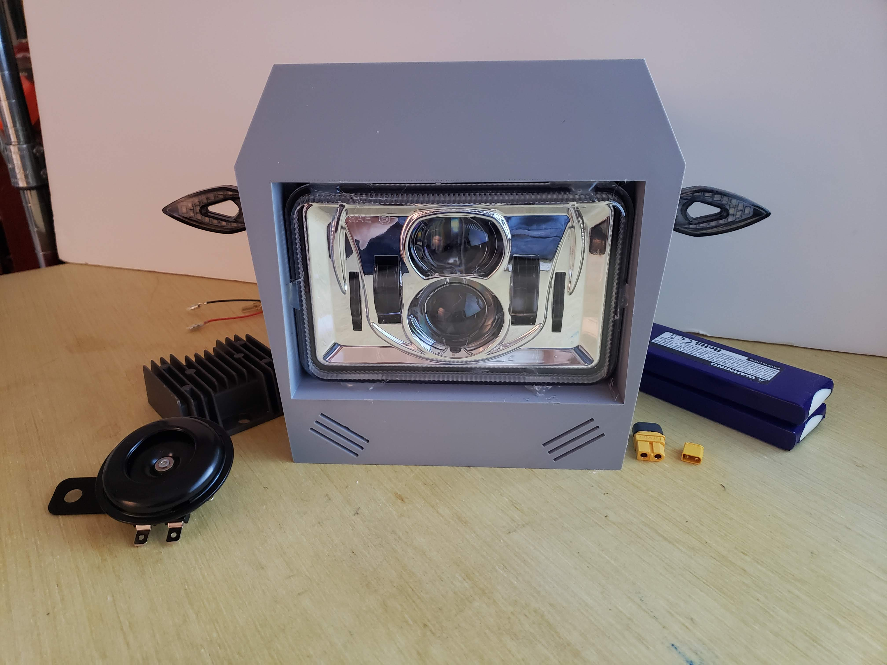

you probably can just look at it and grasp Apple what's going on# Wire-Less_Persona
## A motorcycle headlight that contains the bike's whole electrical system.
 **The Wire-Less Persona is the face of the motorcycle**

Containing nearly the entire electrical system, dash, and headlight. In many cases, this system allows you to  remove the previous wiring harness. 

* Conceptualized as a __dirt bike conversion kit__ that is self contained and __removable__. 

* Self contained: Makes it easy to install. The absolute minimum external connections are needed.

* Components are made to work together and are already hooked up.

  

* **Contains**:

* **Wire-Less relayBox**: Reads the switches, controls the power, and acts as a fuse panel

* **Handlebar Controls**: Simplifies install by having them pre-wired. 

* **Battery**: LiFePo4 for light weight and long life.

* **Headlight**: LED projector light.

* **Turn signals**: Built in for connivence yet easily changeable.

* **Horn** 

* **Regulator/Rectifier**: It should work with most stators. 

* **Wiring Harness**: With XT connectors for convience. 

* **ToughPi**: Computer to act as a dash. Advanced logging. 

* **Speedometer**

* **Tachometer**

* **Included Sensors:** GPS, IMU unit(accelerometer, Gyroscope, Compass), Air Temp sensor

* **Radios**: Wifi, Bluetooth.

*  If you want more there are some accessories. (fuel gage, temp sensors, ect. )

  

* A basic install only needs power and a rear tail light/turn signal connections.

* *Most users can install in less than 15 minutes* 

  * Can also be removed in less than a few minutes.

* It is a convient way to add an electrical system with all of the "bells and whistles" 

### A Design Made To Be Rugged and Modular and Simple.
* Designed to get wet.  Feel confident the next time you encounter deep mud. 
  
  * IP ratings and epoxy potting. 
  
* Designed to take a beating. Because you shouldn't have to baby your machine.

  * Electrical and physically tough. 

* Individual parts can be changed if you have different needs.

  *  Need more battery power? Add more battery. 
  * Need more light? Add an external light. 
  * There are extra circuits waiting to be filled. 
  
 * The wiring harness is powered by a Wire-Less relayBox for simplicity and advanced functionality.

 * The dash is powered by a Raspberry Pi computer. The most documented computer ever built.

* Want to make your own parts? The design files are available and many parts can be 3D printed. 

* Simplicity is key. Easier to install. Easier to troubleshoot. Easier to repair.

  * System made up of simple circuits that are easy to understand. 

  * Components have their own dedicated functions that are easy to test. 

    

### Plenty of software, plenty of control

Logic can give you advanced control over your circuits using many forms of data.

Some examples that can be used: 

* Fog lights that only turn on with your hi beams.
* Less cluttered handlebars by using just 6 buttons. 
* Seat warmers that only turn on when theres enough power.
* Seat warmers that automatically turn on when it's cold.
* Turn signals that automatically turn off.
* Brake Lights that are controlled by deceleration. 
* Wireless key fob that can detect the last user.
* Parental settings that let you set a temporary top speed.
* A "New Rider Mode" to set a temporary Rev limiter. Say 2000 RPM's
  * A new rider can learn how to use a clutch without the engine producing too much power. 
 * Battery Management keeps track of how much capacity you have left and can regulate state of charge for maximum longevity of the battery. Especially when paired with a float charger.
 * Use your headlights without worrying about your battery going dead.
    * Automatically turn off your headlights before the battery is flat.
    * Automatically turn off your headlights after a time period.
* Crash detection  and Actions:
    * Kill the engine if speed is zero and bike is laid over. 
    * Warn others if bike doesn't get picked up. 
        * Start with blinking the headlights, progress to the horn blipping. 
* Many other features and new ones being thought of every day. 
* **Enable only the features you want.**
* Open source software that is accessible to many programmers.
    * Customize to suit your needs.

#### History

* Stats about your last ride. See your top speed reached, distance driven.
* Log the top speed the vehicle has ever reached.
* Keep track of maintience records.
* See the last time the engine was started. 

## Can you use the Wire-Less Persona?
* The Welcome Guide(TODO) makes it very easy to install with very little background knowlage.  
  * Only the simplest of circuits are used. Making it very easy to install.
  * Very few tools are needed. 
* __Nearly any motorcycle can have the Persona installed but there are a few requirments:__
  * The bike needs a way of generating electricity. - Most motorcycles come with a way to get electricity from the stator. 
  * Most outputs will work. The Persona can run off of DC or AC(up to three phase)
    
  * It is possible for the Persona to just run off of just a battery but time/range will be limited
    
  * The BIKES(TODO) page will have more information.
* The Persona mounts onto the front suspension forks. A univeral solution.
* __Fuel injected__ motorcycles have their own electrical requirements.
  * Persona can be installed alongside the factory system 
  
  * Or, Persona can power a fuel injection system the but will make the install more complex. 
  
____

### Basic install overview:

* Remove the previous headlight or shroud. 
* Attach the Persona onto the forks using the rubber straps. 
* Find the output from the stator and run the wires up to the Persona's power cables
  * Stator output is usually two or three wires. 
  * Optionally use the power going to previous headlight
  * Attach those stator cables to the power cables.
* Attach the handlebar controls to the handlebars.
* Run 6 or 8 wires from the Persona to the rear of the bike for the rear lights.
  * Wires are for: L Turn(& GND) R Turn(& GND) Brake Light(& GND)
  * Optionally Running light (& GND) but usually not needed.
* Plug in the battery. 

* Optional features require more knowledge and install time.
  
  * The Persona controlled kill switch needs installed to prevent the engine from turning one
    * Used for features such as: Key-fob control, Tach limiter etc.
  * Sensors can to be installed on nearly anything. Engine, Coolant, Oil,
  * Second speedometer- For reliability in places where the GPS wont work. 
  * Fuel gage meter can be added that adapts to your own tank - Connect a device that looks like an inline fuel filter.

## Open source project

* Mantained by WhoeverDesigns with the most open license- The Unlicense.

